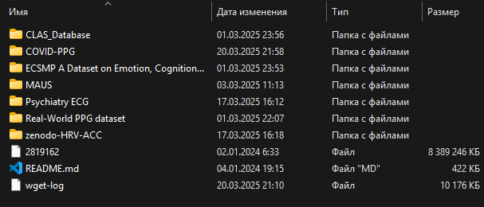

# Наборы данных НЕ из исследований кидать сюда!

Эта папка автоматически не будет синхронизироваться в GitHub, таким образом не давая случайно загрузить туда данные, которые в общем-то быстрее скачать с сайтов-источников, загуглив датасет.

Полный список датасетов на момент конца марта:

